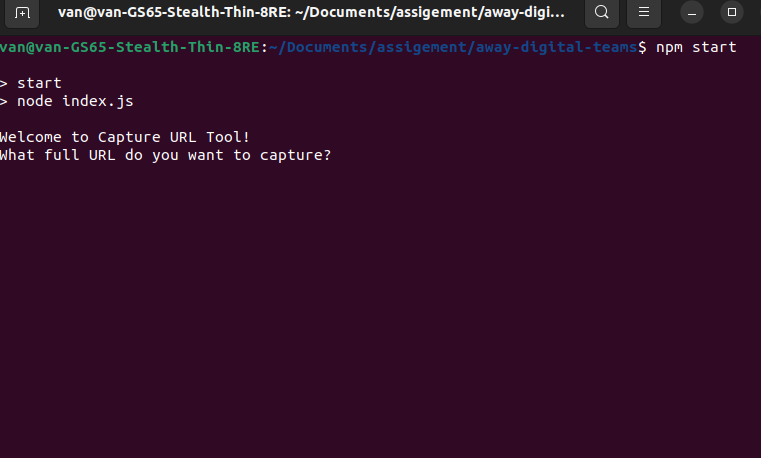
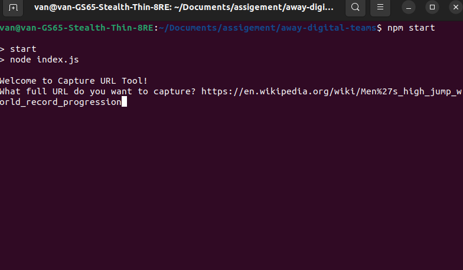
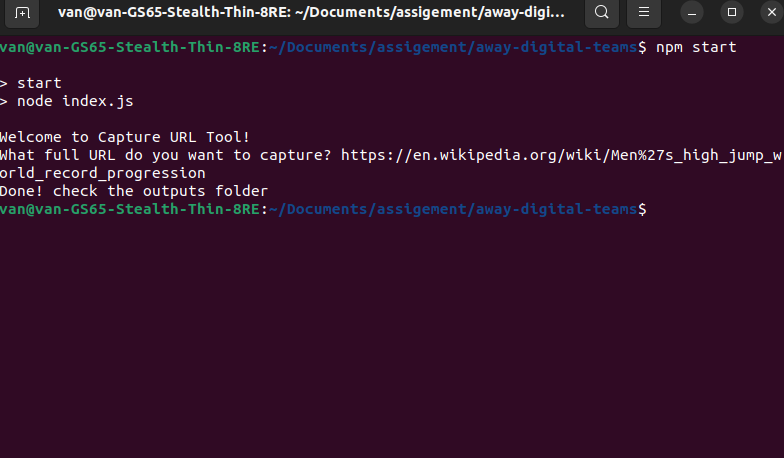

Capture All Table From URL input
----

## Installation

```bash
npm install
```

This tool use some npm package to implement, please run above command to get the library.

I use Node JS version 16 in my computer (Ubuntu 22).

## How to start

### Step 1

Start the source code from same directory

```bash
npm start
```

### Step 2: After start successfully, you will see below screen



### Step 3: Fill the URL like below screen



### Step 4: Press Enter and process, the result like below screen



### Step 5: Check outputs folder to view images


## How to test

```bash
npm run test
```

## How to update test case

Please review test.js file and update the [testCase] const